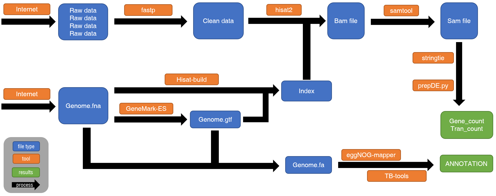

# handonrnaseq
A easy way to conduct rna-seq analysis and it's also my way of learning

## Process

## CN
我在最近第一次做了一次完整的机上分析流程和下机的注释之后，总结了我分析过程中的全流程和踩过的坑，总结了分享出来。
网上关于转录组的各种说法多种多样，什么软件的都有，本文主要参考我自己在网上的查询和从同事朋友中获得的脚本总结而成。

## EN
Recently, I conduct a full-process of rna-seq,from raw data to the gene count and .csv. Since our lab mostly does non-model animals, so it might be complicated compared to model animals like mice.
It takes me about two weeks from completely knowing nothing to finish the task. I have been through many issue like can not install or code doesn't work, some was solved by the blog like accidently find out the in one issue that solution to another question can solve my problem or use CDSDN or stackoverflow.
I hope this may help you whatever you have some experience doing rna-seq analysis or just freshman in bioinformatics analysis.

## Citations
[1] Jiang, G., Zheng, JY., Ren, SN. et al. A comprehensive workflow for optimizing RNA-seq data analysis. BMC Genomics 25, 631 (2024). https://doi.org/10.1186/s12864-024-10414-y
