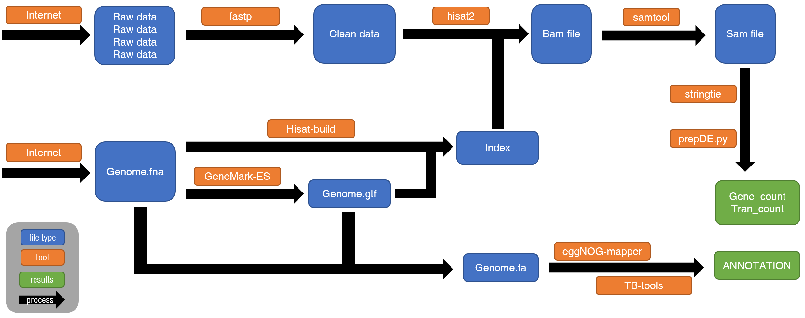

# Hands-on RNA-seq guide

A bilingual, practical walkthrough for paired-end short-read RNA-seq, from raw FASTQ files to read counts and functional annotation.

> This repository is a learning guide and a collection of command templates. It is not a production-ready automated pipeline. Validate parameters, references, and software versions for your own experiment.

[中文指南](CN/README.md) · [English guide](EN/README.md) · [Roadmap / 待补充内容](ROADMAP.md)

## Workflow

```text
paired-end FASTQ
      │
      ▼
fastp quality control
      │
      ▼
HISAT2 alignment
      │
      ▼
samtools sorted/indexed BAM
      │
      ▼
StringTie quantification ──► gene/transcript count matrices
      │
      ▼
gffread + TransDecoder ──► predicted proteins
      │
      ▼
eggNOG-mapper ──► functional annotation
```



## Contents

| Stage | Chinese | English | Main outputs |
|---|---|---|---|
| 1. Quality control | [中文](CN/1.quality_control.txt) | [English](EN/1.quality_control.md) | cleaned FASTQ, fastp HTML/JSON |
| 2. Alignment | [中文](CN/2.alignment.txt) | [English](EN/2.alignment.md) | sorted BAM, BAI, alignment logs |
| 3. Quantification and annotation | [中文](CN/3.quantitive.txt) | [English](EN/3.quantification.md) | count matrices, peptides, annotations |

## Scope and assumptions

- The examples use paired-end reads named `<sample>_1.fq.gz` and `<sample>_2.fq.gz`.
- The reference FASTA and annotation must come from the same assembly release.
- Commands are templates: replace paths, sample IDs, resource requests, and reference names.
- Keep tool versions, logs, sample metadata, reference provenance, and every file transformation.
- Differential-expression analysis is not yet included; see the [roadmap](ROADMAP.md).

## 中文简介

这个仓库记录了一次从原始双端 RNA-seq 数据到表达计数和功能注释的完整实践，尤其关注非模式生物分析中常见的安装、参考注释和格式问题。中文原始笔记保持不变，新增的目录与英文版提供了更清晰的导航、命令模板、结果检查和注意事项。

## English overview

This repository grew from a first complete RNA-seq analysis of a non-model organism. The English guide reorganizes the original notes into reproducible stages, replaces machine-specific paths with explicit placeholders, adds output checks, and distinguishes project experience from general software guidance.

## Citation

The workflow was informed by:

Jiang, G., Zheng, J.Y., Ren, S.N. *et al.* A comprehensive workflow for optimizing RNA-seq data analysis. **BMC Genomics 25**, 631 (2024). https://doi.org/10.1186/s12864-024-10414-y

Please also cite each tool used in your actual analysis.

## License

This repository is distributed under the [GNU General Public License v3.0](LICENSE).
